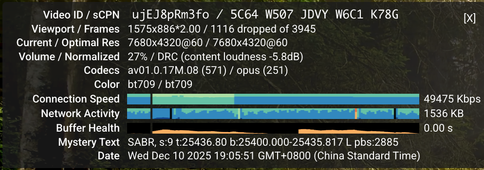
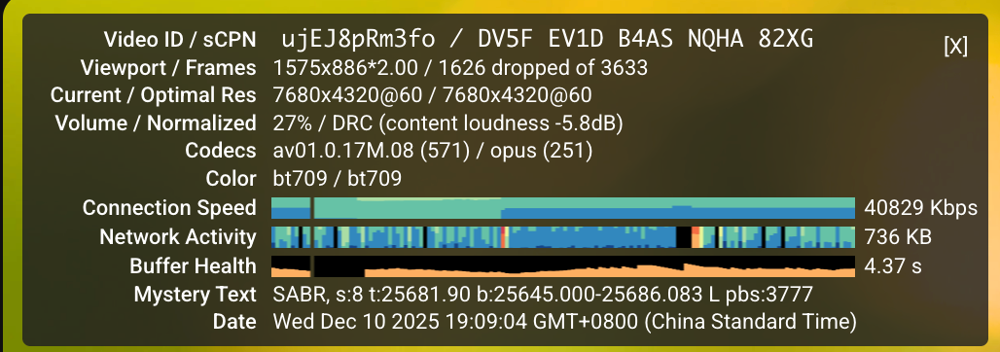
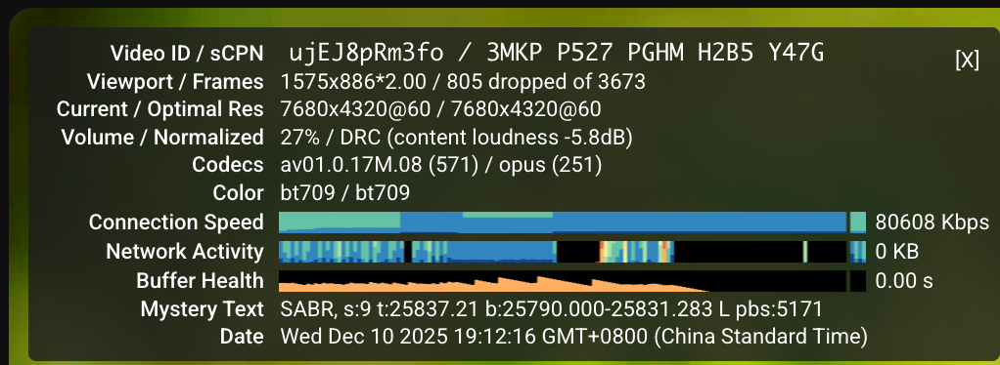
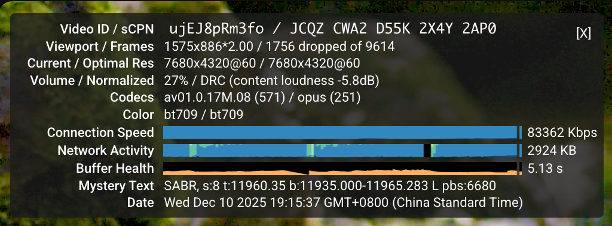
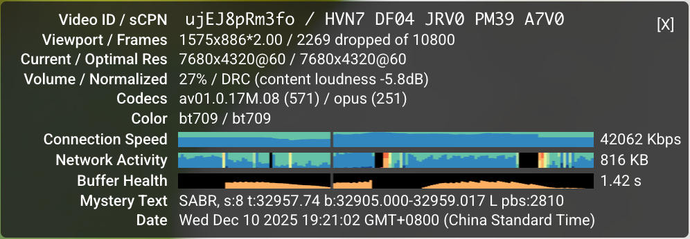
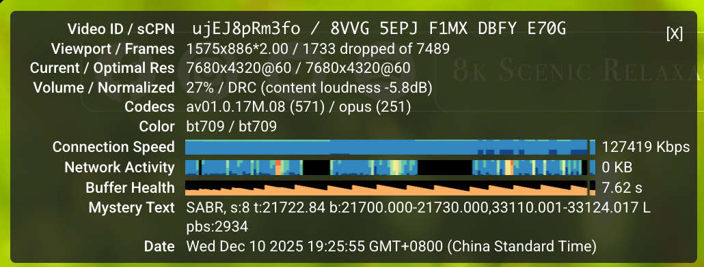

### 代码介绍


[pac](pac)  内网流量整形 

[tapac](tapac) 通过一些资料整理出来的 加速方案 不是很好用

[tapv2](tapv2) 搜索lotServer 使用的相关技术使用Gemini构建

[zeta-tcp-ml](zeta-tcp-ml) 算是比较好用的一个版本 目前还有点小问题。
 
[zeta_tcp](zeta_tcp) 一个参考Zeta-TCP 白皮书的POC版本
 
[apx](apx) 最新在尝试的版本 


----------------------------------------------------------

#### 测试环境


* s-ui (ss)

```bash
root@dev-kernel:/home/apx# cat /etc/os-release
PRETTY_NAME="Ubuntu 24.04 LTS"
NAME="Ubuntu"
VERSION_ID="24.04"
VERSION="24.04 LTS (Noble Numbat)"
VERSION_CODENAME=noble
ID=ubuntu
ID_LIKE=debian
HOME_URL="https://www.ubuntu.com/"
SUPPORT_URL="https://help.ubuntu.com/"
BUG_REPORT_URL="https://bugs.launchpad.net/ubuntu/"
PRIVACY_POLICY_URL="https://www.ubuntu.com/legal/terms-and-policies/privacy-policy"
UBUNTU_CODENAME=noble
LOGO=ubuntu-logo
```


---------------------------------------------


#### 未使用任何算法与内核模块2倍速播放-




####  tapac




#### tapv2




### zeta-tcp-ml



### apx 



### lotspeed



